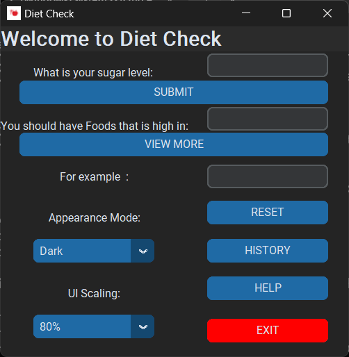

# Diet Check Application

## Overview
Diet Check is a simple yet helpful desktop application designed to give dietary advice based on the user's sugar level. Originally developed as a 12th standard school project using the Tkinter library, this application has been upgraded to utilize **CustomTkinter** for an enhanced modern user interface.

## Key Features
- User-friendly dark-themed interface
- Sugar level input and dietary recommendation
- Alerts for critical sugar levels
- Suggestions for high-protein and fiber-rich foods
- View additional food options
- Reset functionality
- Appearance mode (Light/Dark/System) switching
- UI scaling option

## Technologies Used
- Python
- CustomTkinter

## Collaborator
- [Nabeel](https://github.com/Nabeelnazer)

## Token of Appreciation
A special thanks to **Tom Schimansky**, the founder of CustomTkinter, for creating this amazing library. Check out his work on [GitHub](https://github.com/TomSchimansky/CustomTkinter).

## Application Icon
The application uses a custom icon: **dicon.ico**

## Screenshot


## Running the Application
Ensure you have **Python 3.x** installed along with **CustomTkinter**:
```bash
pip install customtkinter
```

Run the application:
```bash
python dietcheck2.py
```

## Converting to Executable (.exe)
To convert the application into an executable (.exe) file, you can use **PyInstaller**:

1. Install PyInstaller:
```bash
pip install pyinstaller
```

2. Create the executable:
```bash
pyinstaller --onefile --windowed --icon=dicon.ico dietcheck2.py
```

This will generate an executable in the **dist** folder.

## Note
This application is for dietary advice only and should not replace professional medical consultation. Users with critical sugar levels should seek medical attention.

## License
This project is for educational purposes and personal use.